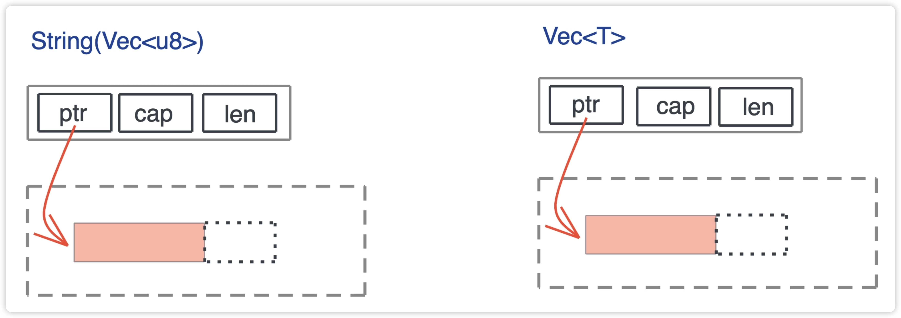

通过前几天的学习，我们了解到：
通过单一所有权模式，Rust 解决了堆内存过于灵活、不容易安全高效地释放的问题，既避免了手工释放内存带来的巨大心智负担和潜在的错误；
又避免了全局引入追踪式 GC 或者 ARC 这样的额外机制带来的效率问题。

同时也引入 Move, Copy, Borrow这些语义。但其实大多数这些概念在其他语言也都是隐式存在的，只不过Rust把它们定义的更清晰，更明确的界定了使用的范围罢了。

今天我们来看看一个值，在内存中从出生到死亡都经历了什么？
先来看一下内存管理
## 内存管理
* 栈内存：优点是分配和释放 性能比较好，在编译器就可以确定了。缺点是无法安全的承载动态大小，或生命周期长到 超出栈帧存货范围以外的值。
* 堆内存：优点是足够灵活，说大就大。缺点是生命周期的管理复杂。

C语言：由码农自己手动控制
C++：在C的基础上加入智能指针，半自动化管理。
Java/.Net/Go：用GC全面接管堆内存，解放码农心智，但有STW的问题。
Rust：重新审视了堆内存的生命周期，发现**大部分堆内存的需求是动态大小，一小部分需求是更长的生命周期**。它默认将堆内存的生命周期和使用它的栈内存的生命周期绑定在一起，并留了Box::leak机制，让堆内存在必要的时候，可以有能力超出帧存活期的生命周期。


## 值的创建
值可能会在栈上创建，也可能在堆上创建。  

像原生类型比如字符、数组、元组（tuple）等，以及开发者自定义的固定大小的结构体（struct）、枚举（enum） 等这些在编译时可以确定大小的值会在栈上创建。

无法确定大小，或需要更长的生命周期的值最好在堆上创建。

### struct
在C语言中，当struct里字段类型不一致的时候，有可能需要做内存对齐，如果字段排序不是很合理的话可能会造成内存浪费。
比如：
```C
#include <stdio.h>

struct S1 {
    u_int8_t a;
    u_int16_t b;
    u_int8_t c;
};

struct S2 {
    u_int8_t a;
    u_int8_t c;
    u_int16_t b;
};

void main() {
    printf("size of S1: %d, S2: %d", sizeof(struct S1), sizeof(struct S2));
    }
```
这一坨代码中，S2只需要4个字节，而S1却需要6个字节。明明放的东西一样，但却占用了更多的空间。

顺便复习一下C 语言对结构体对齐规则：
1. 首先确定每个域的长度和对齐长度，原始类型的对齐长度和类型的长度一致。
2. 每个域的起始位置要和其对齐长度对齐，如果无法对齐，则添加 padding 直至对齐。
3. 结构体的对齐大小和其最大域的对齐大小相同，而结构体的长度则四舍五入到其对齐的倍数。

Rust为了避免S1这种浪费不节俭的情况，会自动优化为S2的情况。在一定程度上解放了我等码农的心智。
还是这个例子：
```rust

use std::mem::{align_of, size_of};

struct S1 {
    a: u8,
    b: u16,
    c: u8,
}

struct S2 {
    a: u8,
    c: u8,
    b: u16,
}

fn main() {
    println!("sizeof S1: {}, S2: {}", size_of::<S1>(), size_of::<S2>());
    println!("alignof S1: {}, S2: {}", align_of::<S1>(), align_of::<S2>());
}
```
但是，如果我们想和C语言对接的时候，就强制不让Rust编译器做优化了，这时候我们可以用这个宏。这样就可以和C代码无缝交互了。
```rust
#[repr]
```

### enum
enum在Rust下它是一个标签联合体，它的大小是标签的大小，加上最大类型的长度。

根据刚才说的三条对齐规则，tag 后的内存，会根据其对齐大小进行对齐，所以对于 Option<u8>，其长度是 1 + 1 = 2 字节，而 Option<f64>，长度是 8 + 8 =16 字节。一般而言，64 位 CPU 下，enum 的最大长度是：最大类型的长度 + 8，因为 64 位 CPU 的最大对齐是 64bit，也就是 8 个字节。

下图展示了 enum、Option<T> 以及 Result<T, E> 的布局：


Rust 编译器还会对 enum 做优化，让某些常用结构的内存布局更紧凑。
直接上代码：
```rust
use std::collections::HashMap;
use std::mem::size_of;

enum E {
    A(f64),
    B(HashMap<String, String>),
    C(Result<Vec<u8>, String>),
}

// 这是一个声明宏，它会打印各种数据结构本身的大小，在 Option 中的大小，以及在 Result 中的大小
macro_rules! show_size {
    (header) => {
        println!(
            "{:<24} {:>4}    {}    {}",
            "Type", "T", "Option<T>", "Result<T, io::Error>"
        );
        println!("{}", "-".repeat(64));
    };
    ($t:ty) => {
        println!(
            "{:<24} {:4} {:8} {:12}",
            stringify!($t),
            size_of::<$t>(),
            size_of::<Option<$t>>(),
            size_of::<Result<$t, std::io::Error>>(),
        )
    };
}

fn main() {
    show_size!(header);
    show_size!(u8);
    show_size!(f64);
    show_size!(&u8);
    show_size!(Box<u8>);
    show_size!(&[u8]);

    show_size!(String);
    show_size!(Vec<u8>);
    show_size!(HashMap<String, String>);
    show_size!(E);
}
```
我们发现，Option 配合带有引用类型的数据结构，比如 &u8、Box、Vec、HashMap ，并**没有额外占用空间。**

```
Type                        T    Option<T>    Result<T, io::Error>
----------------------------------------------------------------
u8                          1        2           24
f64                         8       16           24
&u8                         8        8           24
Box<u8>                     8        8           24
&[u8]                      16       16           24
String                     24       24           32
Vec<u8>                    24       24           32
HashMap<String, String>    48       48           56
E                          56       56           64
```

对于 Option 结构而言，它的 tag 只有两种情况：0 或 1， tag 为 0 时，表示 None，tag 为 1 时，表示 Some。

正常来说，当我们把它和一个引用放在一起时，虽然 tag 只占 1 个 bit，但 64 位 CPU 下，引用结构的对齐是 8，所以它自己加上额外的 padding，会占据 8 个字节，一共 16 字节，这非常浪费内存。怎么办呢？

Rust 是这么处理的，我们知道，引用类型的第一个域是个指针，而指针是不可能等于 0 的，但是我们可以复用这个指针：**当其为 0 时，表示 None，否则是 Some，减少了内存占用，**这是个非常巧妙的优化，我们可以学习。

### vec<T> 和 String
从刚才的结果我们发现String和Vec<u8>占用内存大小一样。其实我们看String的源码可以发现它的内部就是一个Vec<u8>。
```rust
#[derive(PartialOrd, Eq, Ord)]
#[cfg_attr(not(test), rustc_diagnostic_item = "String")]
#[stable(feature = "rust1", since = "1.0.0")]
pub struct String {
    vec: Vec<u8>,
}
```

而 Vec<T> 结构是 3 个 word 的胖指针，包含：一个指向堆内存的指针 pointer、分配的堆内存的容量 capacity，以及数据在堆内存的长度 length，（这里其实可以对比go的slice结构）
```rust
#[stable(feature = "rust1", since = "1.0.0")]
#[cfg_attr(not(test), rustc_diagnostic_item = "Vec")]
#[rustc_insignificant_dtor]
pub struct Vec<T, #[unstable(feature = "allocator_api", issue = "32838")] 
    A: Allocator = Global> {
    buf: RawVec<T, A>,
    len: usize,
}
```
如下图所示：
</img>


**栈内存放的胖指针，指向堆内存分配出来的数据**， 我们之前介绍的 Rc 也是如此。

---

好了，值已经创建成功了，我们对它的内存布局有了一些认识。
那在使用期间，它的内存会发生什么样的变化呢，我们明天接着看。

我是老张一个陪你成长的码农，
如果喜欢听老张叨叨，帮忙点个关注。好让我继续有动力前行！


## 小结
现在当我们看到一个 Rust 的数据结构，你就可以在脑海中大致浮现出，这个数据结构在内存中的布局：哪些字段在栈上、哪些在堆上，以及它大致的大小。
