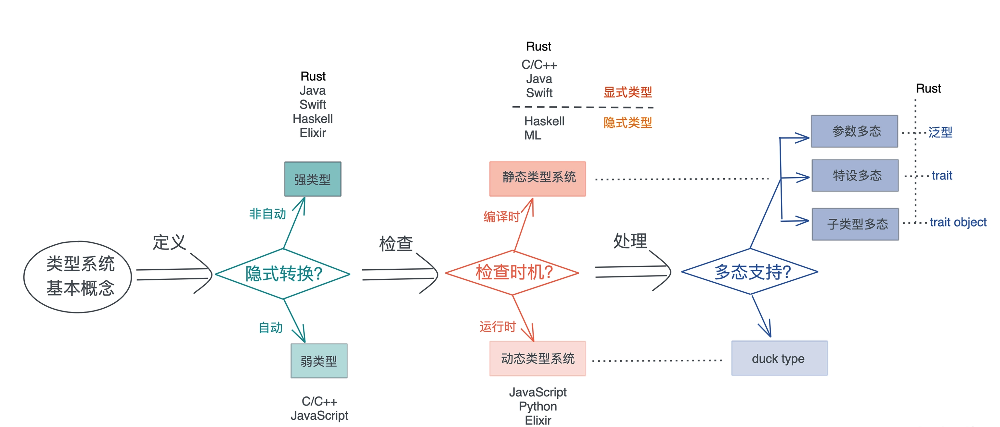

Rust的类型系统到底是什么？能用来干什么？什么时候用呢？今天就来一探究竟。

可以说类型系统完全是一种工具，编译器在编译时对数据做静态检查，在运行时对数据做动态检查的时候，来保证某个操作处理的数据是开发者期望的数据类型。

Rust 类型系统对类型问题的检查格外严格（总是报错）。

## 类型系统基本概念与分类
**类型系统其实就是，对类型进行定义、检查和处理的系统。**
所以，按对类型的操作阶段不同，就有了不同的划分标准，也对应有不同分类。

#### 强类型/弱类型
按是否可以隐式转换，可以分为强类型和弱类型。
Rust 不同类型间不能自动转换，所以是**强类型**语言，
而 C / C++ / JavaScript 会自动转换，是**弱类型**语言。


#### 静态类型系统/动态类型系统
按类型检查的时机，可以分为静态类型系统和动态类型系统。
对于静态类型系统，还可以进一步分为显式静态和隐式静态，
Rust / Java / Swift 等语言都是**显式**静态语言，而 Haskell 是**隐式**静态语言。

##### 多态
在类型系统中，多态是一个非常重要的思想，它是指在**使用相同的接口时，不同类型的对象，会采用不同的实现**。

于动态类型系统，多态通过鸭子类型（duck typing）实现；
而对于静态类型系统，多态可以通过参数多态（parametric polymorphism）、特设多态（adhoc polymorphism）和子类型多态（subtype polymorphism）实现。

* 参数多态是指，代码操作的类型是一个满足某些约束的参数，而非具体的类型。
* 特设多态是指同一种行为有多个不同实现的多态。比如加法，可以 1+1，也可以是 “abc” + “cde”、matrix1 + matrix2、甚至 matrix1 + vector1。在面向对象编程语言中，特设多态一般指函数的重载。
* 子类型多态是指，在运行时，子类型可以被当成父类型使用。

对上述三种多态在 Rust 中，
* 参数多态通过泛型来支持
* 特设多态通过 trait 来支持
* 子类型多态可以用 trait object 来支持



## Rust类型系统
按不同阶段的分类。
* 在定义时， Rust 不允许类型的隐式转换，也就是说，Rust 是强类型语言；
* 在检查时，Rust 使用了静态类型系统，在编译期保证类型的正确。强类型加静态类型，使得 Rust 是一门类型安全的语言。

我们常说的“类型安全”，从内存的角度看**类型安全是指代码，只能按照被允许的方法，访问它被授权访问的内存**。

以数组为例，长度为4，类型为u64。
* 访问这个数组，只能在 起始地址x 到 结束地址x+32 之间的32个字节进行访问。
* 另外数组中的元素都是 u64类型的，所以只能做u64类型允许的操作。

所以 C/C++ 这样，数据定义后还可以隐式转换类型的弱类型语言，不是内存安全的。
Rust 这样的强类型语言，是类型安全的，不会出现开发者不小心引入了一个隐式转换，导致读取不正确的数据，甚至内存访问越界的问题。

这里所谓的隐式类型转换，如算术计算加法，int和double相加，有些语言可以自动转换的，统一为最长类型的，但是这样是有风险的，如字符非数字突然转换为数字等等。

为了做到严格的类型安全，Rust除了let/fn/static/const 定性语句外，都是表达式，表达式总有值，语句不一定有值，有值就有类型。

```rust
if has_work {
    do_something();
}
```
Rust中，一个作用域的最后一个表达式就是返回值。
如果最后一个表达式/函数 没有返回值，那么返回unit(),它的值和类型都()。

## 小结
今天我们知道了 Rust是强类型/静态类型语言。之前我一直以为C系语言是强类型的呢！

Rust作为静态类型，提供了多种数据类型。但在代码里到处写数据类型吧，又很麻烦，Rust又提供了**类型推导**，省去了我们到处写数据类型的麻烦。（但我觉得，新手同学还是都写上清晰一点）

同一个方法，对于参数不同的数据结构，要有不同的实现。Rust还提供了**泛型**。

明天我们一起来学习Rust是如何完成类型推导和如何支持泛型的。

如果你觉得有点收获，欢迎点个关注，也欢迎分享给你身边的朋友。
我是老张 (一个陪你成长的码农)。


