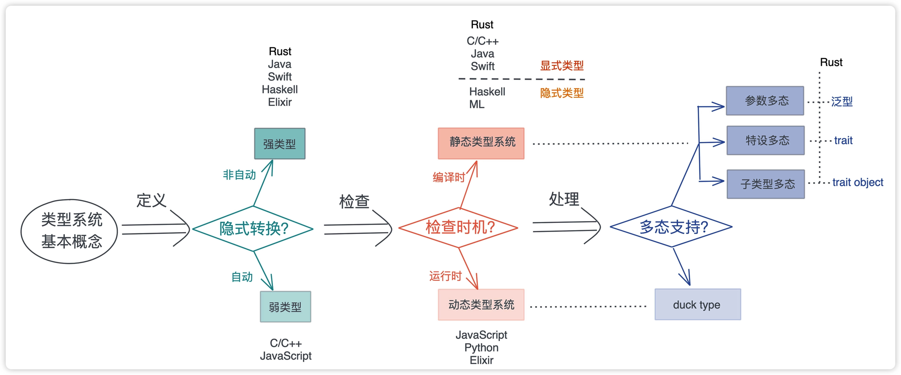
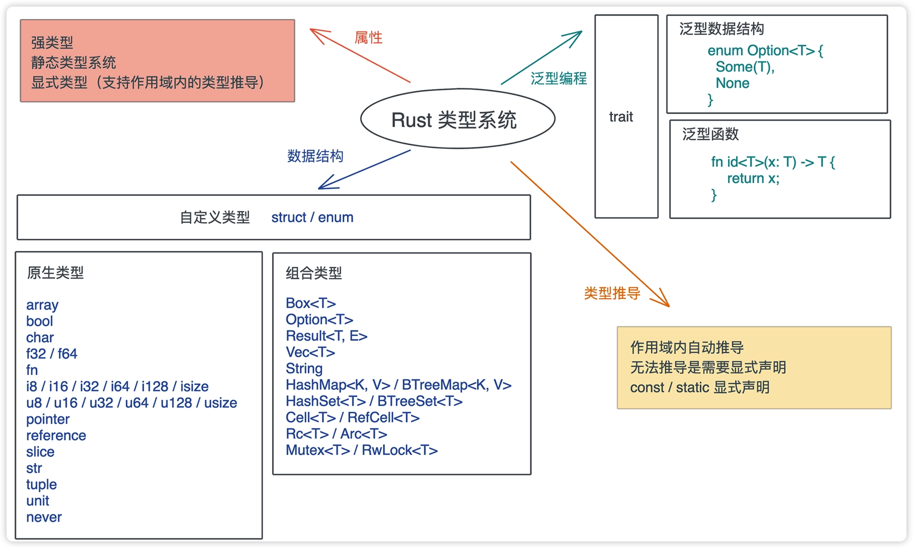

一门编程语言的类型系统会影响到开发者的形式和效率及程序员的安全性。
因为对于计算机而言，它并不知道有什么类型，最终执行的都是一条条指令，或与内存打交道，内存中的数据是字节流。

可以说类型系统是一种工具，用来做编译时对数据静态检查，和运行时对数据的动态检查。

# 类型系统基本概念与分类
**类型系统其实就是对类型进行定义、检查和处理的系统** 。针对类型的操作阶段不同，有不同的划分标准。

按定义后类型是否可以隐式转换，可以分为强类型和弱类型。Rust 不同类型间不能自动转换，所以是强类型语言，而 C / C++ / JavaScript 会自动转换，是弱类型语言。（这个有点突破认知了，之前一直以为C系是强类型语言呢！）

按类型检查的时机，在编译时检查还是运行时检查，可以分为静态类型系统和动态类型系统。对于静态类型系统，还可以进一步分为显式静态和隐式静态，Rust / Java / Swift 等语言都是显式静态语言，而 Haskell 是隐式静态语言。

在类型系统中，多态是一个非常重要的思想，它是指**在使用相同的接口时，不同类型的对象，会采用不同的实现**。(多态我们明天再聊。)


概念关系如下图:


## Rust类型系统
* 强类型语言：在定义时不允许类型的隐式转换。
* 静态类型：编译期保证类型的正确。

这2点保障了Rust的类型安全。


从内存的角度看，**类型安全是指代码，只能按照规定的方法，访问被授权的内存。**
以下图为例，一个类型为u64，长度是4的数组。


## 数据类型
Rust里的数据类型分为原生类型和组合类型。
* 原生类型：字符、整数、浮点数、布尔值、数组（array）、元组（tuple）、切片（slice）、指针、引用、函数等。
* 组合类型：Box、Option、Result、Vec、String、HashMap、RefCell等。

  
| 基础类型    | 介绍 | 示例 |
| --- | --- | --- |
|  array   | 数组，固定大小的同构序列, [T;N] | [u32;16]|
|  bool   | 布尔值 | true, false|
|  char   | utf-8字符 | 'a' |
|  f32/f64   | 浮点数 | 0f32,3.14 |
|  fn  | 函数指针 | fn(&str) -> usize |
|  i8/i16/i32/i64/i128/isize   | 有符号整数 | 0i32, 1024i128 |
|u8/u16/u32/u64/u128/usize | 无符号整数 | 0u8,1024 |
|point | 裸指针:在解引用时是不安全的 | let x = 42;<br> let raw = &x as *const i32;<br>  let mut y = 24;<br> let raw_mut = &mut y as *mut i32;<br>|
|reference | 引用， &T， &mut T | let x = 42;<br> let ref = &x ;<br>  let mut y = 24;<br> let ref_mut = &mut y;<br> |
| slice | 切片， 动态数组，用[T]表述| let boxed:Box<[i32]> = Box::new([1,2,3]);<br> let slice = &boxed; |
| str | 字符串切片，一般用其引用&str,&mut str | let s:&str = "hello world";|
| tuple | 元组，固定大小的异构序列，表述为(T,U) | ("Hello", 1, false) |
| unit | 也就是()类型，表示没有值 | let a = ();<br> let result = Ok();<br> fn hello() {}等价于 fn hello() -> () {} |

除了上面原生类型的基础上，Rust 标准库还支持非常丰富的组合类型：

| 基础类型    | 介绍 | 示例 |
| --- | --- | --- |
|  Box<T>   | 分配在堆上的类型T | let v:Box<i32> = Box::new(1);|
|Option<T>| T要么存在，要么为None|Some(42)<br>None|
|Result<T,E>| 要么成功Ok(T),要么失败Err(E)| Ok(42) <br> Err(ConnectionError::TooMany) |
|Vec<T>| 可变列表，分配在堆上|let mut arr = vec[1,2,3];|
|String| 字符串| let s = String::from("hello");|
|HashMap<K,V>|哈希表|let map:HashMap<&str, &str> = HashMap::new();|
|HashSet<T>|集合|let set:HashSet<u32>=HashSet::new();|
|RefCell<T>| 为T提供内部可变性的智能指针|let v = RefCell::new(42);<br> let mut borrowed = v.borrow_mut();|
|Rc<T>/Arc<T>|为T提供引用计数的智能指针|let v = Rc::new(42);<br>let v1 = Arc::new(42);|


之后我们学到新的数据类型再往这个表里加。除了这些已有的数据类型，咱们也可以使用struct，enum定义自己的组合类型。

## 类型推导
Rust设计者为了减轻，开发的负担。让咱们可以不用到处写各种类型的声明，让Rust支持局部的类型推导。**在一个作用域之内，Rust可以根据上下文，推导出变量的类型**。
比如这一坨代码,创建一个 BTreeMap 后，往这个 map 里添加了 key 为 “hello”、value 为 “world” 的值。
```rust
use std::collections::BTreeMap;

fn main() {
    let mut map = BTreeMap::new();
    map.insert("hello", "world");
    println!("map: {:?}", map);
}
```
Rust编译器可以从上下文中推导出， BTreeMap<K, V> 的类型 K 和 V 都是字符串引用 &str，所以这段代码可以编译通过。但它也不是啥时候都能推导出来的，它需要足够的上下文信息。
比如这一坨代码：
```rust

fn main() {
    let numbers = vec![1, 2, 3, 4, 5, 6, 7, 8, 9, 10];

    let even_numbers = numbers
        .into_iter()
        .filter(|n| n % 2 == 0)
        .collect();

    println!("{:?}", even_numbers);
}
```
collect是Iterator的方法，很多集合类型都实现了这个方法，那这里的collect究竟要返回什么类型，编译器就没办法推导出来了。
编译时，会报这个错:“consider giving even_numbers a type”
这时候，我们可以声明一个类型，告诉编译器用哪个类型的Iterator。
```rust
fn main() {
    let numbers = vec![1, 2, 3, 4, 5, 6, 7, 8, 9, 10];

    let even_numbers: Vec<_> = numbers
        .into_iter()
        .filter(|n| n % 2 == 0)
        .collect();

    println!("{:?}", even_numbers);
}
```
## 泛型
一门静态语言如果不支持泛型，开发者用起来还是比较痛苦的。(我记得Golang在1.18之前，就是这样，需要把每一种的输入参数类型重新实现一遍，即使逻辑是一样的。)

那我们看下Rust是如何支持泛型的？
先看参数多态，包括泛型数据结构和泛型函数。

### 泛型数据结构
Rust 对数据结构的泛型，或者说参数化类型，有着完整的支持。
我们先看下这坨代码
```rust
enum Option<T> {
  Some(T),
  None,
}
```
这代表T是任意类型， 当Option 有值的时候，就是Some(T)，没值的时候就是None。
定义这个泛型结构的过程有点像在定义函数：
* 函数，是把重复代码中的参数抽取出来，使其更加通用，调用函数的时候，根据参数的不同，我们得到不同的结果；
* 而泛型，是把重复数据结构中的参数抽取出来，在使用泛型类型时，根据不同的参数，我们会得到不同的具体类型。

再看一个Vec<T>的例子：
```rust
pub struct Vec<T, A: Allocator = Global> {
    buf: RawVec<T, A>,
    len: usize,
}

pub struct RawVec<T, A: Allocator = Global> {
    ptr: Unique<T>,
    cap: usize,
    alloc: A,
}
```
Vec有两个参数，一个是 T，是列表里的每个数据的类型，另一个是 A，它有进一步的限制  A: Allocator ，也就是说 A 需要满足 Allocator trait。

A 这个参数有默认值 Global，它是 Rust 默认的全局分配器，这也是为什么 Vec<T> 虽然有两个参数，使用时都只需要用 T。

----
在 Rust 里，生命周期标注也是泛型的一部分，一个生命周期 'a 代表任意的生命周期，和 T 代表任意类型是一样的。来看一个枚举类型 Cow<T> 的例子：
```rust
pub enum Cow<'a, B: ?Sized + 'a> where B: ToOwned,
{
    // 借用的数据
    Borrowed(&'a B),
    // 拥有的数据
    Owned(<B as ToOwned>::Owned),
}
```
Cow数据结构像前面的Option一样，返回的数据
* 要么返回一个借用的数据（只读）
* 要么返回一个有 所有权的数据（可写）

泛型参数是有约束的，对于数据B有三个约束：
* 生命周期约束：B的生命周期是'a，所以B需要满足'a，
* ?Sized：?代表可以放松问号之后的约束，默认的泛型参数是Sized。这里的 **?Sized代表可变大小的类型**。
* 符合ToOwned trait：ToOwned 是一个 trait，它可以把借用的数据克隆出一个拥有所有权的数据。

上面 Vec 和 Cow 的例子中，泛型参数的约束都发生在开头 struct 或者 enum 的定义中，其实，很多时候，我们也可以 **在不同的实现下逐步添加约束**

### 泛型函数
现在知道泛型数据结构如何定义和使用了，再来看下泛型函数，它们的思想是类似的。
**在声明一个函数的时候，我们还可以不指定具体的参数或返回值的类型，而是由泛型参数来代替**。
看下面这坨例子：
id() 是一个泛型函数，它的入参类型是泛型，返回值类型也是泛型。
```rust
fn id<T>(x: T) -> T {
    return x;
}

fn main() {
    let int = id(10);
    let string = id("Tyr");
    println!("{}, {}", int, string);
}
```
Rust对于泛型函数，会进行单态化处理。
所谓单态化处理就是在编译的时候，把泛型函数的泛型参数，展开成一系列函数。

所以上面这个简单的例子在进行单态化处理之后，会变成这样。
```rust
fn id_i32(x: i32) -> i32 {
    return x;
}
fn id_str(x: &str) -> &str {
    return x;
}
fn main() {
    let int = id_i32(42);
    let string = id_str("Tyr");
    println!("{}, {}", int, string);
}
```
单态化的优缺点都比较明显：
优点：**泛型函数的调用是静态分发**，在编译时就做到一一对应，既有多态的灵活性，又没有任何执行效率的损失。
缺点：编译速度很慢。**一个泛型函数，编译器需要找到所有用到的不同类型，一个个编译**。所以 Rust 编译代码的速度总被人吐槽


## 小结
这2天我们介绍了类型系统的一些基本概念以及 Rust 的类型系统。
用一张图描述了 Rust 类型系统的主要特征，包括其属性、数据结构、类型推导和泛型编程：


明天我们继续学习特设多态，子类型多态。
