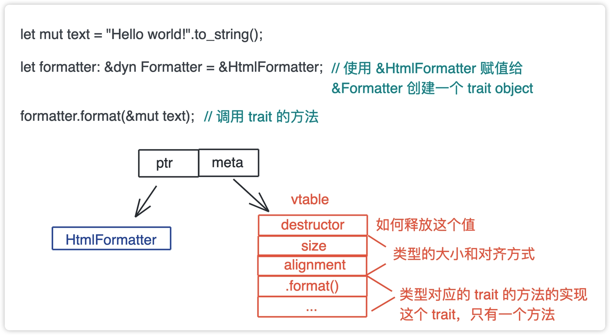
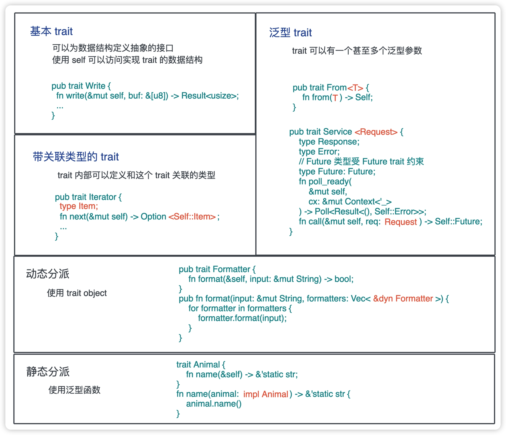

昨天我们一起学习了trait及多态，并通过一个字符串解析的例子练习了一下。

今天我们继续学习下子类型多态。
一般来说子类型多态，都是出现在面向对象语言里的。
说的是**对象Child是对象Parent的子类，那么Child实例可以出现在任何期望Parent的实例的上下文中**

虽然在Rust中并没有父类和子类的概念。
不过trait和trait的类型之间却有类似的关系。
这么说Rust也可以实现子类型多态了。

看下这坨代码
```rust

struct Cat;
struct Dog;

trait Animal {
    fn name(&self) -> &'static str;
}

impl Animal for Cat {
    fn name(&self) -> &'static str {
        "Cat"
    }
}

impl Animal for Dog {
    fn name(&self) -> &'static str {
        "Dog"
    }
}

fn name(animal: impl Animal) -> &'static str {
    animal.name()
}

fn main() {
    let cat = Cat;
    println!("cat: {}", name(cat));
}
```
这一坨代码，还是比较简单的，
Cat 和Dog都实现了 Animal这个trait里的name方法。
前面我们学习泛型函数的时候说过泛型函数会被单态化，编译成多个实例， 是静态分派的。

静态分派虽然效率很高，**但很多时候，类型可能很难在编译时决定。**
举个例子：有一个格式化的接口Formatter，还有markdown,html,rust的不同实现。
代码如下：
```rust
pub trait Formatter {
    fn format(&self, input: &mut String) -> bool;
}

struct MarkdownFormatter;
impl Formatter for MarkdownFormatter {
    fn format(&self, input: &mut String) -> bool {
        input.push_str("\nformatted with Markdown formatter");
        true
    }
}

struct RustFormatter;
impl Formatter for RustFormatter {
    fn format(&self, input: &mut String) -> bool {
        input.push_str("\nformatted with Rust formatter");
        true
    }
}

struct HtmlFormatter;
impl Formatter for HtmlFormatter {
    fn format(&self, input: &mut String) -> bool {
        input.push_str("\nformatted with HTML formatter");
        true
    }
}
```
1. 只有打开文件，读取内容才知道，用哪个formatter。无法在编译期确定。
2. 像我们这个文章里，既有markdown，也有rust，可能还有html标签，会同时用到多个formatter。

如果这里用Vec来表示，那么Vec<>容器里的类型是需要一致的。
**在 Rust 里，这种类型叫 Trait Object**
表现为 &dyn Trait 或者 Box<dyn Trait>。
dyn 关键字只是用来帮助我们更好地区分普通类型和 Trait 类型.
阅读代码时，看到 dyn 就知道后面跟的是一个 trait 了。

于是这样就可以构造一个Fomatter的列表了，
```rust
pub fn format(input: &mut String, formatters: Vec<&dyn Formatter>) {
    for formatter in formatters {
        formatter.format(input);
    }
}
```
这样可以在运行时，构造一个 Formatter 的列表，传递给 format 函数进行文件的格式化，这就是**动态分派**（dynamic dispatching）。

## Trait Object的实现机制
可以这样使用Formatter trait做动态分派：

HtmlFormatter 的引用赋值给 Formatter 后，会生成一个 Trait Object，在上图中可以看到，Trait Object 的底层逻辑就是胖指针。其中，一个指针指向数据本身，另一个则指向虚函数表（vtable）。

vtable 是一张静态的表，Rust 在编译时会为使用了 trait object 的类型的 trait 实现生成一张表。

在这张表里，包含具体类型的一些信息，如 size、aligment 以及一系列函数指针：
* 这个接口支持的所有的方法，比如 format() ；
* 具体类型的 drop trait，当 Trait object 被释放，它用来释放其使用的所有资源。

这样，当在运行时执行 formatter.format() 时，formatter 就可以从 vtable 里找到对应的函数指针，执行具体的操作。

使用 trait object 的时候，要注意对象安全（object safety）。只有满足对象安全的 trait 才能使用 trait object。

这么说还有不是对象安全的。
如果**一个trait的所有方法:其返回值是Self，或携带泛型参数，** 就 **不能** 产生trait Object。
原因：
1. trait object产生的时候，原来的类型就覆盖了，如果返回Self就不知道是谁了。
2. 昨天刚提到过泛型函数会在编译时，做单态化，而trait object是运行时的，两者不兼容。


## 小结
这2天我们完整地学习了 trait 是如何定义和使用的，包括最基本的 trait、带关联类型的 trait，以及泛型 trait。我们还回顾了通过 trait 做静态分发以及使用 trait object 做动态分发。



trait 作为对不同数据结构中相同行为的一种抽象，它可以让我们 **在开发时，通过用户需求，先敲定系统的行为，把这些行为抽象成 trait，之后再慢慢确定要使用的数据结构，以及如何为数据结构实现这些 trait**。

所以，trait 是你做 Rust 开发的核心元素。什么时候使用什么 trait，需要根据需求来确定。

但是需求往往不是那么明确的，尤其是因为我们要把用户需求翻译成系统设计上的需求。这种翻译能力，得靠足够多源码的阅读和思考，以及足够丰富的历练，一点点累积成的。因为 **Rust 的 trait 再强大，也只是一把瑞士军刀，能让它充分发挥作用的是持有它的那个人**。

如果你觉得有点收获，欢迎点个关注，也欢迎分享给你身边的朋友。
明天我们继续学习一些常用的trait。