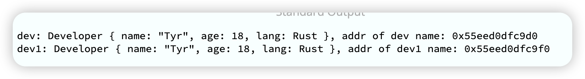

在进行软件设计的时候，面向接口(trait)编程，会提高程序的扩展性。
经过这几天的学习，我们队trait已经有进一步的理解。在实际工程中，**合理运用trait，会让我们的代码结构更清晰。**

## trait
我们先来看看已经接触到的一些trait。
* Clone / Copy trait，约定了数据被深拷贝和浅拷贝的行为；
* Read / Write trait，约定了对 I/O 读写的行为；
* Iterator，约定了迭代器的行为；Debug，约定了数据如何被以 debug 的方式显示出来的行为；
* Default，约定数据类型的缺省值如何产生的行为；
* From<T> / TryFrom<T>，约定了数据间如何转换的行为。
  
接下来我们还会学习几类比较重要的trait:
1. 和内存分配释放相关的 trait
2. 用于区别不同类型协助编译器做类型安全检查的标记 trait
3. 进行类型转换的 trait、操作符相关的 trait
4. Debug/Display/Default。

今天我们先学习内存相关的3个trait

### 内存相关：Clone / Copy / Drop
首先来看内存相关的 Clone/Copy/Drop。
其实这三个 trait 在介绍所有权的时候已经接触过，这里我们再深入研究一下它们的定义和使用场景。
#### Clone trait
Clone trait有两个方法：
1. clone() 
2. clone_from() 有缺省实现。
```rust
pub trait Clone {
  fn clone(&self) -> Self;

  fn clone_from(&mut self, source: &Self) {
    *self = source.clone()
  }
}
```
那这2个有什么区别呢？
```rust
// 如果a已经存在
a = b.clone();  // clone过程会分配内存。
a.clone_from(&b); // 避免内存分配，提高效率。
```
这2句，如果如果 a 已经存在，在 clone 过程中会分配内存，那么**用  a.clone_from(&b) 可以避免内存分配，提高效率。**

Clone trait 可以通过派生宏直接实现，这样能简化不少代码。
如果是struct 数据结构里，每一个字段都已经实现了 Clone trait，
那么可以用  #[derive(Clone)]。
比如这里的Developer和Language。
```rust
#[derive(Clone, Debug)]
struct Developer {
  name: String,
  age: u8,
  lang: Language
}

#[allow(dead_code)]
#[derive(Clone, Debug)]
enum Language {
  Rust,
  TypeScript,
  Elixir,
  Haskell
}

fn main() {
    let dev = Developer {
        name: "Tyr".to_string(),
        age: 18,
        lang: Language::Rust
    };
    let dev1 = dev.clone();
    println!("dev: {:?}, addr of dev name: {:p}", dev, dev.name.as_str());
    println!("dev1: {:?}, addr of dev1 name: {:p}", dev1, dev1.name.as_str())
}

```
这样是可以运行的，结果如下:

我们观察dev里name的地址和dev1里name的地址是一样的。
这说明，字段name 不仅拷贝了栈上的内容，连堆上的内容也一起拷贝了，所以Clone是深度拷贝。

但是当我们把Language的Clone实现去掉后，Developer也不行了。
报错如下: 


**注意**：Clone方法的接口是&self。对 **Rc<T> 这样在 clone() 时维护引用计数的数据结构，clone() 过程中会改变自己，所以要用 Cell<T> 这样提供内部可变性的结构来进行改变**

---

### Copy trait
Copy trait没有额外的方法，它是一个标记trait(marker trait)
代码定义如下：
```rust
pub trait Copy: Clone {}
```
要实现Copy就必须实现Clone trait，这样没有任何方法的trait有什么用呢？

这样的 trait **虽然没有任何行为，但它可以用作 trait bound 来进行类型安全检查**，所以我们管它叫**标记 trait**。

和Clone一样，如果是struct，那它里面的所有字段都必须实现了Copy。
我们为Developer 和 Language一起加上Copy:
```rust
#[derive(Clone, Copy, Debug)]
struct Developer {
  name: String,
  age: u8,
  lang: Language
}

#[derive(Clone, Copy, Debug)]
enum Language {
  Rust,
  TypeScript,
  Elixir,
  Haskell
}
```
并没有如期运行。报错如下：


从错误信息可以看出是因为name的类型是String，String没有实现Copy，导致Developer也无法实现Copy。

让我们回顾一下之前的知识：
1. 之前我们了解到在赋值、函数调用时，值的类型如果实现了Copy会被拷贝，否则所有权会被Move(移动)。
所以当Developer 类型在做参数传递时，会执行 Move 语义，而 Language 会执行 Copy 语义。
2. 在讲可变引用/不可变引用时说到，不可变引用（只读）实现了Copy，而可变引用没有实现Copy。因为一个作用域下一个变量只能有1个可变引用。


### Drop trait
代码定义如下：
```rust
pub trait Drop {
    fn drop(&mut self);
}
```
大部分场景无需为数据结构提供 Drop trait，系统默认会依次对数据结构的每个域做 drop。但有两种情况你可能需要手工实现 Drop。
1. 希望在数据结束生命周期的时候做一些事情，比如记日志。（有点类似 装饰模式）
2. 需要对资源回收的场景。编译器并不知道你额外使用了哪些资源，也就无法帮助你 drop 它们。比如说锁资源的释放，在 MutexGuard 中实现了 Drop 来释放锁资源：
```rust
impl<T: ?Sized> Drop for MutexGuard<'_, T> {
    #[inline]
    fn drop(&mut self) {
        unsafe {
            self.lock.poison.done(&self.poison);
            self.lock.inner.raw_unlock();
        }
    }
}
```
**注意**：Copy和Drop是互斥的，**Copy是按位做浅拷贝，它会默认拷贝的数据没有需要释放的资源；而Drop是为了释放额外的资源**，这两就像一对冤家。

试想一下，一个引用着堆上数据的指针同时实现了Copy和Drop，然后Copy了多次，此时也就意味着有这个指针引用着堆上的数据，当某一个指针被栈帧销毁的时候，drop trait发生的作用，把堆上的内存也释放了，那么其他的指针就变成的悬垂指针，这是明显use after free的问题。

实际上，任何编程语言都无法保证不发生人为的内存泄漏，比如程序在运行时，开发者疏忽了，对哈希表只添加不删除，就会造成内存泄漏。但 Rust 会保证即使开发者疏忽了，也不会出现内存安全问题。

明天我们继续学习其他常用的trait。

如果你觉得有点收获，欢迎点个关注，
也欢迎分享给你身边的朋友。

