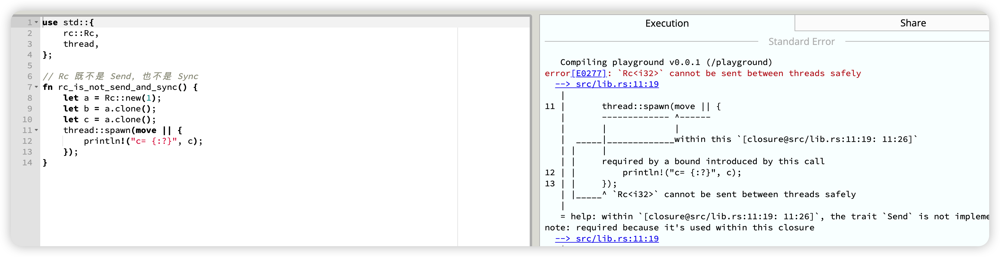
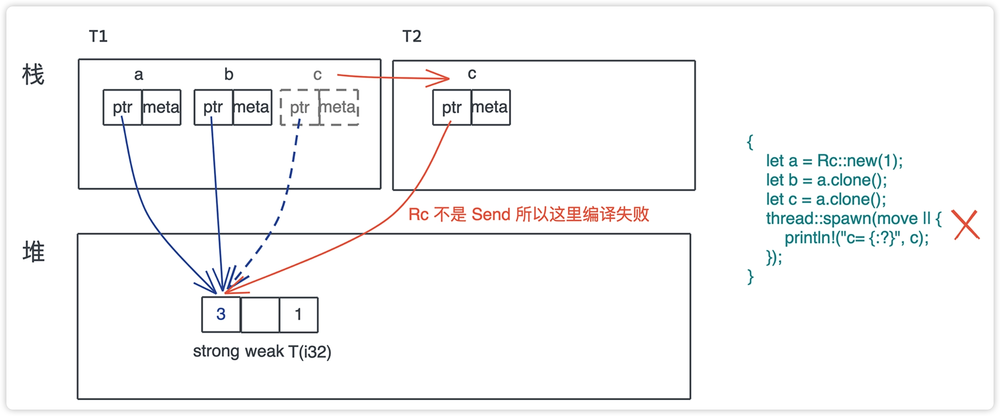
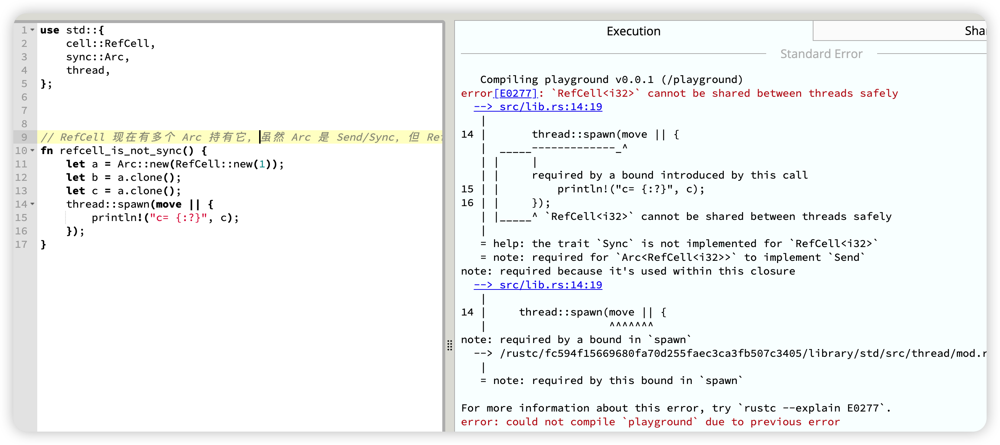

昨天我们一起学习了 内存相关的3个常用trait Clone/Copy/Drop。

今天我们继续学习 
## 标记trait
昨天的学习Copy trait也是一种标记trait。
Rust还支持一些常用的标记trait Size/Send/Sync/Unpin。

### Size
Size trait用于标记有具体大小的类型。
在使用泛型参数时，Rust 编译器会自动为泛型参数加上 Sized 约束。
比如以下这两坨代码作用是一样的。
```rust
struct Data<T> {
    inner: T,
}

fn process_data<T>(data: Data<T>) {
    todo!();
}
```

```rust
struct Data<T: Sized> {
    inner: T,
}

fn process_data<T: Sized>(data: Data<T>) {
    todo!();
}
```
但是，在一些情况下，上述代码中的T是可变类型，这时候类型大小就不一致了。Rust提供 **?Size** 来解决这个问题。（我到是觉得挺形象的，它也打问号，也不知道多大size。哈哈！）

如果开发者定义了 T:?Sized，那么T就可以是任意大小了。
如：
```rust
pub enum Cow<'a, B: ?Sized + 'a> where B: ToOwned,
{
    // 借用的数据
    Borrowed(&'a B),
    // 拥有的数据
    Owned(<B as ToOwned>::Owned),
}
```

### Send / Sync
我们来看先Send和Sync的代码定义:
```rust
pub unsafe auto trait Send {}
pub unsafe auto trait Sync {}
```
这两个 trait 都是 unsafe auto trait。
auto:是指编译器会在合适的场合，自动为数据结构添加它们的实现。
unsafe: 代表实现的这个 trait 可能会违背 Rust 的内存安全准则。

如果开发者手工实现这两个 trait ，要自己为它们的安全性负责。  

Send/Sync 是 Rust 并发安全的基础：
* 如果一个类型 T 实现了 Send trait，意味着 T 可以安全地从一个线程移动到另一个线程，也就是说所有权可以在线程间移动。
* 如果一个类型 T 实现了 Sync trait，则意味着 &T 可以安全地在多个线程中共享。一个类型 T 满足 Sync trait，当且仅当 &T 满足 Send trait。

Send/Sync 在线程安全中的作用：
1. 如果一个类型 T: Send，那么 T 在**某个线程中的独占访问**是线程安全的；
2. 如果一个类型 T: Sync，那么 T 在**线程间的只读共享**是安全的。

标准库中不支持Send/Sync的数据结构主要有：
* **裸指针** *const T / *mut T。它们是不安全的，所以既不是 Send 也不是 Sync。
* **UnsafeCell<T>** 不支持 Sync。也就是说，任何使用了 Cell 或者 RefCell 的数据结构不支持 Sync。
* **引用计数 Rc** 不支持 Send 也不支持 Sync。所以 Rc 无法跨线程。

如果在线程间传递 Rc，是无法编译通过的，因为 Rc 的实现不支持 Send 和 Sync。(所以rc只能在一个线程里用咯？)
我们来试一下：
```rust
use std::{
    rc::Rc,
    thread,
};
// Rc 既不是 Send，也不是 Sync
fn rc_is_not_send_and_sync() {
    let a = Rc::new(1);
    let b = a.clone();
    let c = a.clone();
    thread::spawn(move || {
        println!("c= {:?}", c);
    });
}
```
果然没有通过。
从报错信息可以看到 说rc不能在线程间安全send。




那RefCell可以吗？
我们也来试一下：
```rustuse 
std::{
    cell::RefCell,
    thread,
};

fn refcell_is_send() {
    let a = RefCell::new(1);
    thread::spawn(move || {
        println!("a= {:?}", a);
    });
}
```
发现是可以Ok的。

---

支持Send/Sync的**Arc可以在多线程间共享，并修改吗** ？
继续尝试
```rust
use std::{
    cell::RefCell,
    sync::Arc,
    thread,
};

// RefCell 现在有多个 Arc 持有它，虽然 Arc 是 Send/Sync，但 RefCell 不是 Sync
fn refcell_is_not_sync() {
    let a = Arc::new(RefCell::new(1));
    let b = a.clone();
    let c = a.clone();
    thread::spawn(move || {
        println!("c= {:?}", c);
    });
}
```
发现还是不行


因为 **Arc 内部的数据是共享的**，需要**支持 Sync** 的数据结构，但是 **RefCell 不是 Sync**，编译失败。

不过我们可以使用支持Send/Sync的Arc和Mutex一起构造一个可以在多线程间共享切可以修改的类型。
```rust
use std::{
    sync::{Arc, Mutex},
    thread,
};

// Arc<Mutex<T>> 可以多线程共享且修改数据
fn arc_mutext_is_send_sync() {
    let a = Arc::new(Mutex::new(1));
    let b = a.clone();
    let c = a.clone();
    let handle = thread::spawn(move || {
        let mut g = c.lock().unwrap();
        *g += 1;
    });

    {
        let mut g = b.lock().unwrap();
        *g += 1;
    }

    handle.join().unwrap();
    println!("a= {:?}", a);
}

fn main() {
    arc_mutext_is_send_sync();
}
```


