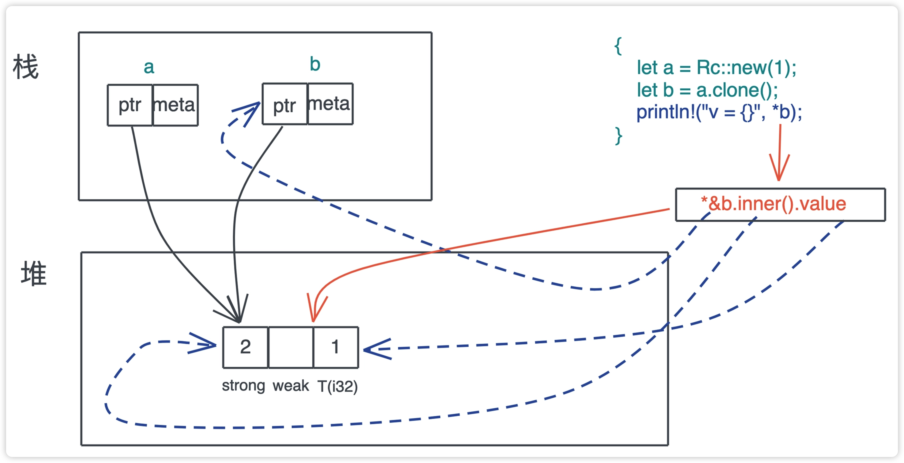
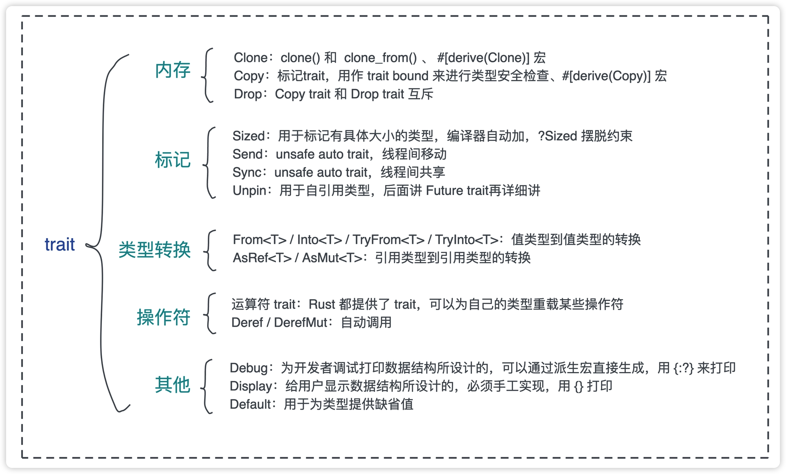

前两天我们学习了内存相关，标记trait，今天我们来学习一下类型转换和操作符相关的常用trait。

在开发中，我们经常需要把一个类型转换成另一种类型。

我们先来看下，这几种方式的比较。
```rust
// 第一种方法，为每一种转换提供一个方法
// 把字符串 s 转换成 Path
let v = s.to_path();
// 把字符串 s 转换成 u64
let v = s.to_u64();

// 第二种方法，为 s 和要转换的类型之间实现一个 Into<T> trait
// v 的类型根据上下文得出
let v = s.into();
// 或者也可以显式地标注 v 的类型
let v: u64 = s.into();
```
这还用比吗？显然第二种，对于我们这种码农来说更友好，只需要记一种格式就行了。不同类型的转换都实现一个数据转换trait，这样可以用同一个方法实现不同类型的转换，（有点像泛型？）这样也**符号开闭原则，对扩展开放，对修改关闭**。底层可以扩展更多的数据类型，原来的不用修改，只需要新增实现即可。

按照这个思路，Rust按照值类型和引用类型提供两套不同的trait。
* 值类型: From \<T> / Into \<T> / TryFrom \<T> / TryInto \<T>
* 引用类型: AsRef \<T> / AsMut \<T>

### 值类型
先看值类型的 From和Into的代码定义：
```
pub trait From<T> {
    fn from(T) -> Self;
}

pub trait Into<T> {
    fn into(self) -> T;
}

// 实现 From 会自动实现 Into
impl<T, U> Into<U> for T where U: From<T> {
    fn into(self) -> U {
        U::from(self)
    }
}
```
从代码中可以看到，在实现From<T>的时候会自动实现Into<T>。

一般情况，只用实现From,这2种方式都可以做类型做转换。
比如这样：
```
let s = String::from("Hello world!");
let s: String = "Hello world!".into();
```

我们再来看一下 Into 是怎么让代码变的灵活的吧。

```rust
use std::net::{IpAddr, Ipv4Addr, Ipv6Addr};

fn print(v: impl Into<IpAddr>) {
    println!("{:?}", v.into());
}

fn main() {
    let v4: Ipv4Addr = "2.2.2.2".parse().unwrap();
    let v6: Ipv6Addr = "::1".parse().unwrap();
    
    // IPAddr 实现了 From<[u8; 4]，转换 IPv4 地址
    print([1, 1, 1, 1]);
    // IPAddr 实现了 From<[u16; 8]，转换 IPv6 地址
    print([0xfe80, 0, 0, 0, 0xaede, 0x48ff, 0xfe00, 0x1122]);
    // IPAddr 实现了 From<Ipv4Addr>
    print(v4);
    // IPAddr 实现了 From<Ipv6Addr>
    print(v6);
}
```

**注意**：如果你的数据类型在转换过程中有可能出现错误，可以使用 **TryFrom \<T> 和 TryInto \<T>**，它们的用法和 From / Into 一样，只是 trait 内多了一个关联类型 Error，且返回的结果是 Result<T, Self::Error>。

### 引用类型
AsRef\<T> 和 AsMut\<T> 用于从引用到引用的转换。还是先看它们的代码定义：

```rust
pub trait AsRef<T> where T: ?Sized {
    fn as_ref(&self) -> &T;
}

pub trait AsMut<T> where T: ?Sized {
    fn as_mut(&mut self) -> &mut T;
}
```
从这2个的定义可以看出，允许T的大小可变类型，如：str、[u8]之类的。
另外AsMut除了是可变引用之外，其他的都和AsRef一样，所以我们主要看AsRef。

我们还是通过一坨代码来感受一下怎么用AsRef。
```rust
#[allow(dead_code)]
enum Language {
    Rust,
    TypeScript,
    Elixir,
    Haskell,
}

impl AsRef<str> for Language {
    fn as_ref(&self) -> &str {
        match self {
            Language::Rust => "Rust",
            Language::TypeScript => "TypeScript",
            Language::Elixir => "Elixir",
            Language::Haskell => "Haskell",
        }
    }
}

fn print_ref(v: impl AsRef<str>) {
    println!("{}", v.as_ref());
}

fn main() {
    let lang = Language::Rust;
    // &str 实现了 AsRef<str>
    print_ref("Hello world!");
    // String 实现了 AsRef<str>
    print_ref("Hello world!".to_string());
    // 我们自己定义的 enum 也实现了 AsRef<str>
    print_ref(lang);
}
```
对于已经实现了AsRef的 &str和String我们可以直接使用，对于还没有实现的Language，我们需要手动实现一下。

现在我们队如何使用 From / Into / AsRef / AsMut 进行类型间转换，有了初步的了解。

## 操作符相关
我们之前学习过Add<Rhs> trait，它可以重载加法运算符。
其实Rust为所有的运算符都提供了trait，你可以为自己的类型重载一些操作符。

### Deref 和 DerefMut
今天重点要介绍的操作符是 Deref 和 DerefMut。
还是先看下 代码定义：
```rust
pub trait Deref {
    // 解引用出来的结果类型
    type Target: ?Sized;
    fn deref(&self) -> &Self::Target;
}

pub trait DerefMut: Deref {
    fn deref_mut(&mut self) -> &mut Self::Target;
}
```
可以看到DerefMut "继承"了Deref，还多了一个方法deref_mut，用来获取可变的解引用。

```rust
let mut x = 42;
let y = &mut x;
// 解引用，内部调用 DerefMut（其实现就是 *self）
*y += 1;
```
对于普通的引用，解引用很直观，因为它只有一个指向值的地址。
但是对于只能指针来说，解引用就没那么直观了.
我们来看Rc是如何实现Deref的
```rust
impl<T: ?Sized> Deref for Rc<T> {
    type Target = T;

    fn deref(&self) -> &T {
        &self.inner().value
    }
}
```

可以看到，它最终指向了堆上的 RcBox 内部的 value 的地址，然后如果对其解引用的话，得到了 value 对应的值。以下图为例，最终打印出 v = 1。


在 Rust 里，绝大多数智能指针都实现了 Deref，我们也可以为自己的数据结构实现 Deref。

还是用一坨代码来感受一下
```rust
use std::ops::{Deref, DerefMut};

#[derive(Debug)]
struct Buffer<T>(Vec<T>);

impl<T> Buffer<T> {
    pub fn new(v: impl Into<Vec<T>>) -> Self {
        Self(v.into())
    }
}

impl<T> Deref for Buffer<T> {
    type Target = [T];

    fn deref(&self) -> &Self::Target {
        &self.0
    }
}

impl<T> DerefMut for Buffer<T> {
    fn deref_mut(&mut self) -> &mut Self::Target {
        &mut self.0
    }
}

fn main() {
    let mut buf = Buffer::new([1, 3, 2, 4]);
    // 因为实现了 Deref 和 DerefMut，这里 buf 可以直接访问 Vec<T> 的方法
    // 下面这句相当于：(&mut buf).deref_mut().sort()，也就是 (&mut buf.0).sort()
    buf.sort();
    println!("buf: {:?}", buf);
}
```
我们为Buffer实现了Deref和DerefMut，这样在解引用的时候，直接访问到buf.0。

这里有一个比较有意思的点：

我们并没有对Buff实现sort方法。
main里的buf.sort()也没有做解引用的操作，但是却相当于直接访问了buf.0.sort()。

这是因为sort()方法的第一个参数是&mut self,
这里的buf.sort() 相当于 Vec::sort(&mut buf)。

此时 Rust 编译器会强制做 Deref/DerefMut 的解引用，所以这相当于 (*(&mut buf)).sort()。

不过，我刚开始学，其实还没有太明白！这里的弯弯绕。

## 其他

### Debug / Display
代码定义如下：
```rust
pub trait Debug {
    fn fmt(&self, f: &mut Formatter<'_>) -> Result<(), Error>;
}

pub trait Display {
    fn fmt(&self, f: &mut Formatter<'_>) -> Result<(), Error>;
}
```

有点奇怪的是 这两的定义是一样的。
**Debug是我们码农调试打印用的，Display是给用户展示用的。**
在使用的时候，Debug 用 {:?} 来打印，Display 用 {} 打印。

### Default trait
为数据类型提供默认值，定义如下：
```rust
pub trait Default {
    fn default() -> Self;
}
```
可以用#[derive(Default)]来生成实现，还是和之前的要求一样，组合类型里的每个字段都需要实现Default trait才可以。

举个栗子：
```rust

use std::fmt;
// struct 可以 derive Default，但我们需要所有字段都实现了 Default
#[derive(Clone, Debug, Default)]
struct Developer {
    name: String,
    age: u8,
    lang: Language,
}

// enum 不能 derive Default
#[allow(dead_code)]
#[derive(Clone, Debug)]
enum Language {
    Rust,
    TypeScript,
    Elixir,
    Haskell,
}

// 手工实现 Default
impl Default for Language {
    fn default() -> Self {
        Language::Rust
    }
}

impl Developer {
    pub fn new(name: &str) -> Self {
        // 用 ..Default::default() 为剩余字段使用缺省值
        Self {
            name: name.to_owned(),
            ..Default::default()
        }
    }
}

impl fmt::Display for Developer {
    fn fmt(&self, f: &mut fmt::Formatter<'_>) -> fmt::Result {
        write!(
            f,
            "{}({} years old): {:?} developer",
            self.name, self.age, self.lang
        )
    }
}

fn main() {
    // 使用 T::default()
    let dev1 = Developer::default();
    // 使用 Default::default()，但此时类型无法通过上下文推断，需要提供类型
    let dev2: Developer = Default::default();
    // 使用 T::new
    let dev3 = Developer::new("Tyr");
    println!("dev1: {}\\ndev2: {}\\ndev3: {:?}", dev1, dev2, dev3);
}
```

# 小结
这几天我们一起学习了内存、类型转换，操作符等常用的trait。


**一个设计良好的 trait 可以大大提升整个系统的可用性和扩展性。**

明天我们继续学习智能指针。

如果你觉得有点收获，欢迎点个关注， 也欢迎分享给你身边的朋友。