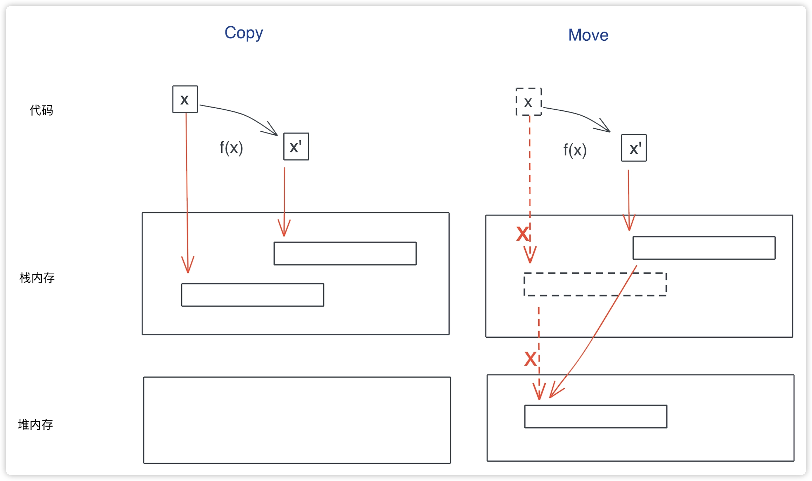
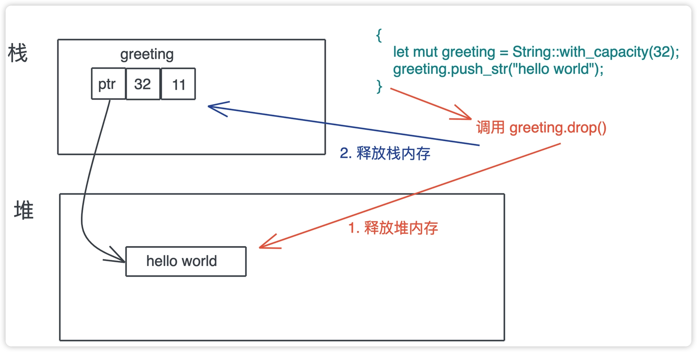
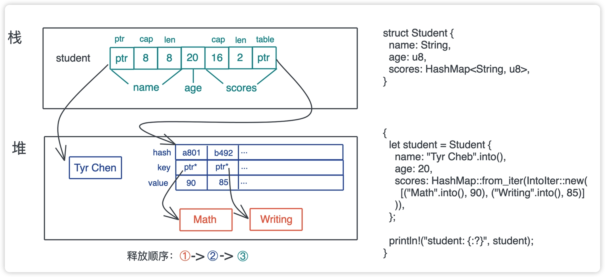

昨天在聊了 Rust里值的创建的相关点，今天来看看值的使用及销毁。

## 值的使用
之前我们学习所有权的时候，了解到一个值如果没有实现Copy，在赋值，传参，函数返回的时候会被Move。

**其实 Copy 和 Move 在内部实现上，都是浅层的按位做内存复制**，只不过 Copy 允许你访问之前的变量，而 Move 不允许。 （所以 Move = Copy + Delete，而Copy貌似并不对堆内存进行操作？）

在我们的印象中，内存拷贝是一个比较重的操作，重就代表性能低。所以我们在之前的编程语言中，如果数据较大的值， 在进行传参的时候建议传引用，这样会减少内存拷贝带来的性能问题。在赋值的时候也会采用写时拷贝。

而如果只拷贝原生类型(Copy)或栈上的胖指针（Move），不涉及堆内存的深度拷贝（deep copy），这个性能还是比较高的。所以无论是Copy 还是Move，性能都是非常高的。

凡是总有一些例外，比如：我们要尽量避免对栈上的大数组进行传参，如果非要传，建议使用文中刚才提到的，传引用而不是直接传值。

在使用值的过程中，除了 Move，你还需要注意值的动态增长。因为 Rust 下，集合类型的数据结构，都会在使用过程中自动扩容。

以 Vec<T> 为例，在不斷增減 Vec 以後，可能會觸發堆內存自動增長，但到最後只用到很小的一部分，造成很多不必要的內存浪費，可以使用 shrink_to_fit 來節約對內存的使用。

## 值的销毁
之前有提到，当所有者离开作用域，它拥有的值会被丢弃。那Rust 到底是咋丢弃的呢？
这里要提到Drop trait，**当一个值要被释放，它的 Drop trait 会被调用。**

拿这坨代码来说
```rust
{
    let mut greeting = String::with_capacity(32);
    greeting.push_str("hello_world");
}
```

字符串变量greeting在离开当前作用域的时候，会调用它的drop()，从而达到释放堆上"hello world"的内存，再释放变量在栈上的内存。

基础数据结构类型一次drop()就完事儿了，那么复杂数据结构呢？
struct结构体在调用 drop() 时，会依次调用每一个字段的 drop() 函数，如果字段又是一个复杂的结构或者集合类型，就会递归下去，直到每一个字段都释放干净。

比如下面这个例子
```rust
struct Student {
    name:String,
    age:u8,
    scores:HashMap<String, u8>,
}

{
    let student = Student {
        name:"Tyr Cheb".into(),
        age:20,
        scores:HashMap::form_iter(IntoIter::new(
            [("Math".into(), 90), ("Writing".into(), 85)]
        )),
    };
    println!("student:(:?)", student);
}
```

student 变量是一个结构体，有 name、age、scores。其中 name 是 String，scores 是 HashMap，它们本身需要额外 drop()。
又因为 HashMap 的 key 是 String，所以还需要进一步调用这些 key 的 drop()。整个释放顺序从内到外是：先释放 HashMap 下的 key，然后释放 HashMap 堆上的表结构，最后释放栈上的内存。




## 堆内存释放
所有权机制规定了，一个值只能有一个所有者，所以在释放堆内存的时候，整个过程简单清晰，就是单纯调用 Drop trait，不需要有其他顾虑。这种对值安全，也没有额外负担的释放能力，是 Rust 独有的。

Rust 在内存管理方面的设计像是公司管理，一个个简单死板的规章制度， **大量简单的制度能构造出一个高效且不出错的系统。**

在 Rust 里，你自定义的数据结构，绝大多数情况下，不需要实现自己的 Drop trait，编译器缺省的行为就足够了。但是，如果你想自己控制 drop 行为，你也可以为这些数据结构实现它。

如果你定义的 drop() 函数和系统自定义的 drop() 函数都 drop() 某个域，Rust 编译器会确保，这个域只会被 drop 一次。至于 Drop trait 怎么实现、有什么注意事项、什么场合下需要自定义，我们在后面再详细学习。

## 释放其他资源
我们刚才讲 Rust 的 Drop trait 主要是为了应对堆内存释放的问题，其实，它还可以释放任何资源，比如 socket、文件、锁等等。Rust 对所有的资源都有很好的 支持。

比如我们创建一个文件 file，往里面写入 “hello world”，当 file 离开作用域时，不但它的内存会被释放，它占用的资源、操作系统打开的文件描述符，也会被释放，也就是文件会自动被关闭。
```rust
use std::fs::File;
use std::io::prelude::*;
fn main() -> std::io::Result<()> {
    let mut file = File::create("foo.txt")?;
    file.write_all(b"hello world")?;
    Ok(())
}
```
这个比较厉害了，无论C还是 Golang，你都需要显式地关闭文件，避免资源的泄露。这是因为，即便 GC 能够帮助开发者最终释放不再引用的内存，它并不能释放除内存外的其它资源。
Golang里可能还需要用defer 来close一下。

虽然只是节省了一个小小的close，但是一个复杂的业务代码里，**一旦，多个变量和多种异常或者错误叠加，我们忘记释放资源的风险敞口会成倍增加**，很多死锁或者资源泄露就是这么产生的。

从 Drop trait 中我们再一次看到，从事物的本原出发解决问题，会极其优雅地解决掉很多其他关联问题。好比，所有权，几个简单规则，就让我们顺带处理掉了资源释放的大难题。


## 小结
这两天我们一起学习了
* 值的创建，使用，及销毁过程，
* 如何在内存中布局的，大小和对齐之间的关系；
* 数据在使用过程中，是如何 Move 和自动增长的；以及数据是如何销毁的。


如果你觉得有点收获，欢迎点个关注，也欢迎分享给你身边的朋友。
我是老张 -- (一个陪你成长的码农)。
我们明天接着唠。
